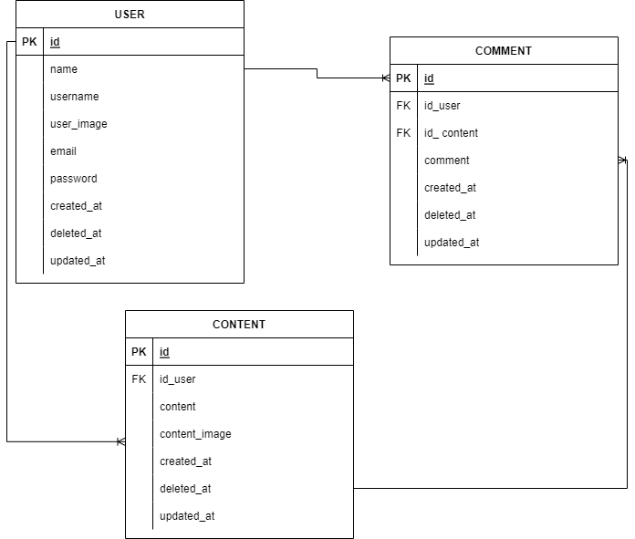

# Circle Apps

This is a golang rest api project group organized by Alterra Academy. This API is used to run Circle applications. This application has features as below.

# Features
## User:
- Register
- Login
- Show profile
- Edit profile
- Dactive account

## Content :
- Show all content
- Show detail content
- Add content
- Edit content
- Delete content

## Comment :
- Add comment
- Delete comment

# ERD

# API Documentations

[Click here](https://app.swaggerhub.com/apis-docs/icxz1/SosmedAPI/1.0.0#/)
